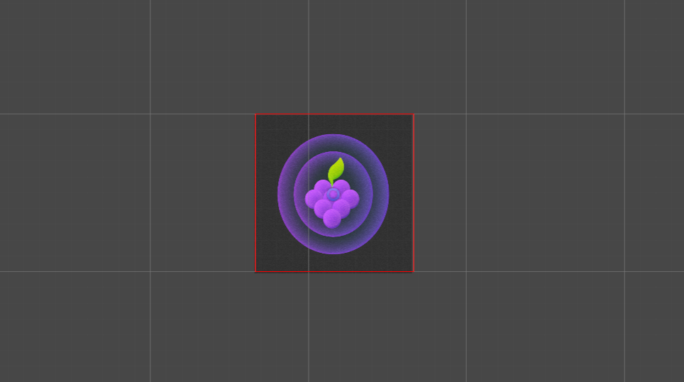
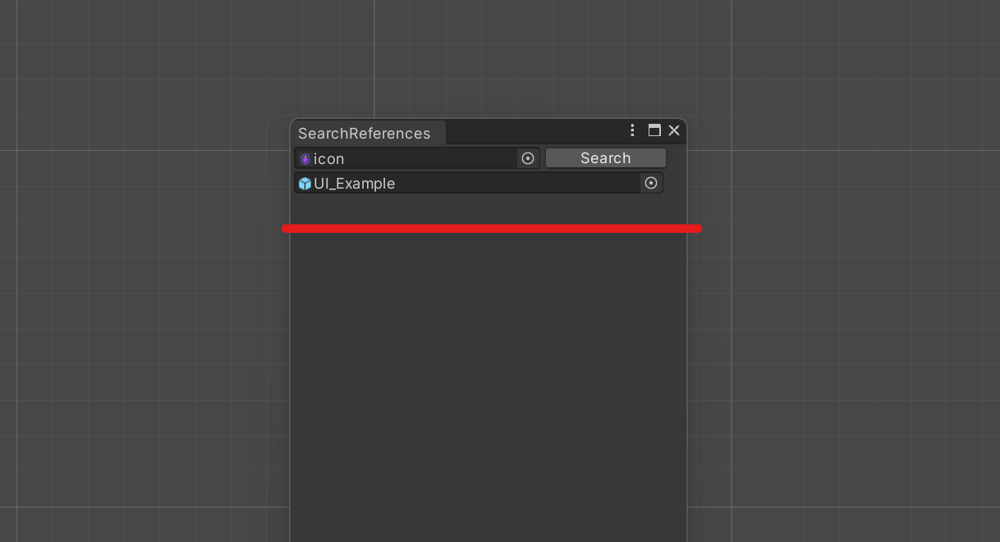
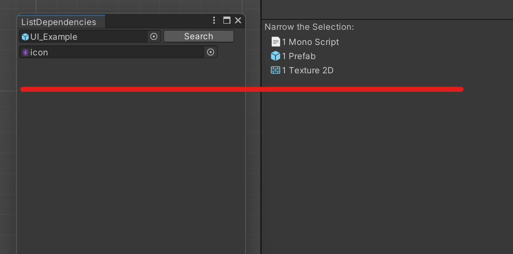

一些项目积累的UGUI优化技巧。
<!--more-->

## UI上显示特效

使用ParticleSystem，并设置好sortingOrder。优点是灵活自由，缺点是容易跟UI的层级产生冲突，UI的sortingOrder规划可以设置如下：
+ 1000是背景UI层
+ 2000是正常UI层
+ 3000是置顶UI层

特效根据需要设置为这中间的任意值。比如普通的UI的特效，就设置为2500，这样弹窗在3000层就可以正常遮挡住特效。

## Mask和RectMask2D

UGUI中的裁剪常用的是Mask和RectMask2D，其中RectMask2D只能用于2D矩形裁剪，但是性能会高很多。因此UI中优先选用RectMask2D。如果有不规则的裁剪需求，可以考虑Mask。

### RectMask2D
通过设置canvasRenderer.EnableRectClipping来实现矩形裁剪的效果。受其影响的控件的材质会设置上一个 _ClipRect 属性并开启 UNITY_UI_CLIP_RECT。然后shader中通过 UnityGet2DClipping 函数获取当前像素点是否在裁剪区域内。如果不在区域内，则返回0。最终alpha就被设置为0，从而不显示了。

### Mask
利用模板测试，区域之外的裁剪掉。模板测试性能一般，且有兼容性问题，某些很古老的手机不一定支持。另外就是会打断合批。增加至少3个额外的DrawCall。

## 界面显示

+ Tab页尽量做成单独的节目，切换的时候动态加载进来
+ 保证prefab里没用到的对象全部删除
+ 显示隐藏界面时减少使用 `SetActive()` ，因为UI元素的变化导致所在的Canvas变化，触发函数Canvas.SendWillRenderCanvases()与Canvas.BuildBatch()造成高耗时。可以通过修改layer来控制显示隐藏
+ 动态和静态的UI分别挂上不同的Canvas
+ 没有点击交互的图片确认是否取消勾选Raycast Target

## 分析工具

只依赖人力来检查规范不太现实，还需要一些静态的UI界面分析工具，记录一些常用的小工具：

### 是否取消勾选Raycast Target

上文提到，只用来显示作用的图片禁止勾选Raycast Target，但实际制作界面的时候常常是复制之前界面的组件，容易遗忘选项，可以使用工具显示勾选Raycast Target的组件，如果勾选了用红框表示

```C++
using UnityEngine;
using UnityEngine.UI;
public class RaycastTargetLine : MonoBehaviour
{
	static Vector3[] fourCorners = new Vector3[4];
	void OnDrawGizmos()
	{
		foreach (MaskableGraphic g in GameObject.FindObjectsOfType<MaskableGraphic>())
		{
			if (g.raycastTarget)
			{
				RectTransform rectTransform = g.transform as RectTransform;
				rectTransform.GetWorldCorners(fourCorners);
				Gizmos.color = Color.red;
				for (int i = 0; i < 4; i++)
					Gizmos.DrawLine(fourCorners[i]+Vector3.one, fourCorners[(i + 1) % 4] + Vector3.one);
			}
		}
	}
}
```

### 查找图片被哪些prefab引用

项目开始的时候几乎不可能有全部的美术资源，会通过一些临时资源来暂时替代，等到正式资源替换完可以通过查找图片被哪些prefab引用来删除多余的临时资源。

```C++
using UnityEditor;
using UnityEngine;
using System.Collections.Generic;
using System.IO;

public class SearchReferences : EditorWindow
{
    [MenuItem("MiniTool/Search References")]
    static void Open()
    {
        SearchReferences window = (SearchReferences)EditorWindow.GetWindow(typeof(SearchReferences));
        window.Show();
    }
    private static Object searchObject;
    private List<Object> result = new List<Object>();
    private void OnGUI()
    {
        EditorGUILayout.BeginHorizontal();
        searchObject = EditorGUILayout.ObjectField(searchObject, typeof(Object), true, GUILayout.Width(200));
        if (GUILayout.Button("Search", GUILayout.Width(100)))
        {
            result.Clear();
            if (searchObject == null)
                return;
            string assetPath = AssetDatabase.GetAssetPath(searchObject);
            string assetGuid = AssetDatabase.AssetPathToGUID(assetPath);
            //加入筛选，只检查prefab，Assets/Res/UI：被筛选的集合
            string[] guids = AssetDatabase.FindAssets("t:Prefab", new[] { "Assets/Res/UI" });
            int length = guids.Length;
            for (int i = 0; i < length; i++)
            {
                string filePath = AssetDatabase.GUIDToAssetPath(guids[i]);
                EditorUtility.DisplayCancelableProgressBar("Searching", filePath, i / length * 1.0f);
                string content = File.ReadAllText(filePath);
                if (content.Contains(assetGuid))
                {
                    Object fileObject = AssetDatabase.LoadAssetAtPath(filePath, typeof(Object));
                    result.Add(fileObject);
                }
            }
            EditorUtility.ClearProgressBar();
        }
        EditorGUILayout.EndHorizontal();
        EditorGUILayout.BeginVertical();
        for (int i = 0; i < result.Count; i++)
        {
            EditorGUILayout.ObjectField(result[i], typeof(Object), true, GUILayout.Width(300));
        }
        EditorGUILayout.EndHorizontal();
    }
}
```

### 查找prefab引用了那些资源

Unity可以通过 Select Dependencies 来查找物体身上引用的所有资源，正式的项目中一个界面所用到的图片、字体、贴图资源可能是几十个，如果希望可以逐个查看具体的资源位置，可以通过工具来罗列：


```C++
using UnityEditor;
using UnityEngine;
using System.Collections.Generic;
using System.IO;

public class SearchReferences : EditorWindow
{
    [MenuItem("MiniTool/Search References")]
    static void Open()
    {
        SearchReferences window = (SearchReferences)EditorWindow.GetWindow(typeof(SearchReferences));
        window.Show();
    }
    private static Object searchObject;
    private List<Object> result = new List<Object>();
    private void OnGUI()
    {
        EditorGUILayout.BeginHorizontal();
        searchObject = EditorGUILayout.ObjectField(searchObject, typeof(Object), true, GUILayout.Width(200));
        if (GUILayout.Button("Search", GUILayout.Width(100)))
        {
            result.Clear();
            if (searchObject == null)
                return;
            string assetPath = AssetDatabase.GetAssetPath(searchObject);
            string assetGuid = AssetDatabase.AssetPathToGUID(assetPath);
            //加入筛选，只检查prefab，Assets/Res/UI：被筛选的集合
            string[] guids = AssetDatabase.FindAssets("t:Prefab", new[] { "Assets/Res/UI" });
            int length = guids.Length;
            for (int i = 0; i < length; i++)
            {
                string filePath = AssetDatabase.GUIDToAssetPath(guids[i]);
                EditorUtility.DisplayCancelableProgressBar("Searching", filePath, i / length * 1.0f);
                string content = File.ReadAllText(filePath);
                if (content.Contains(assetGuid))
                {
                    Object fileObject = AssetDatabase.LoadAssetAtPath(filePath, typeof(Object));
                    result.Add(fileObject);
                }
            }
            EditorUtility.ClearProgressBar();
        }
        EditorGUILayout.EndHorizontal();
        EditorGUILayout.BeginVertical();
        for (int i = 0; i < result.Count; i++)
        {
            EditorGUILayout.ObjectField(result[i], typeof(Object), true, GUILayout.Width(300));
        }
        EditorGUILayout.EndHorizontal();
    }

}
```
