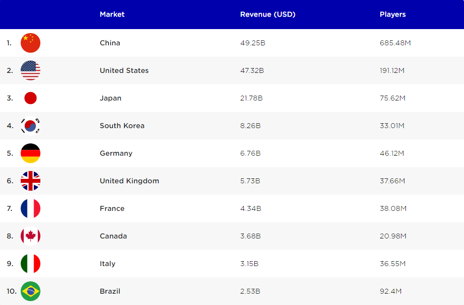
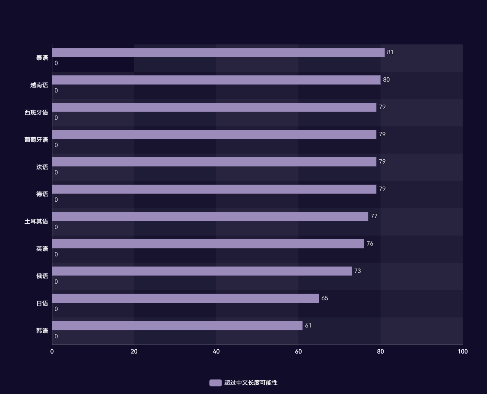
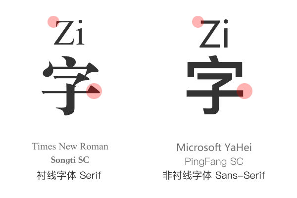

这一年项目有了本地化的需求，记录一下多语言中过程中遇到的语言问题

## 语言选择

根据Newzoo数据，全球游戏收入前十的国家和地区为：中国，美国，日本，韩国，德国，英国，法国，加拿大，意大利和巴西。此排名一直非常稳定，很多游戏公司的本地化会将这些国家所用的语言作为本地化的目标语言。

当然越热门的语言和市场则意味着越激烈的市场竞争，对比来说有的地区缺乏其母语内容的游戏且竞争较小，例如：泰国，越南，土耳其，也是值得考虑的出海地区

## 语言问题

本地化UI中最常见的问题就是文本的超框，用目标语言字符数/对应中文字符数，可以得到不同语言相对于中文的长度比率，数值越大，超框风险越严重。

中英的比例为1:1.6，日韩与中文的比例则约为1:1，德法与中文的比例为1:1.8，俄语、西班牙语、意大利语、葡萄牙语以及阿拉伯语翻译成中文的字数比例则高达1:2。

西方语言：德法西葡俄 字符长度分布趋于一致，这和这几门语言同属印欧语系，词源和语法结构存在一定的相似度有关

东方语言：韩语和日语字符长度分布较为相似、泰语和越南语分布较为相似，韩语和日语虽然属于不同的语系，但是语法结构相似。

## 解决方案

多语言的字段长度不同必然会影响控件表现形式与效果，如果一开始就决定进行海外发行，UI团队在设计阶段，就可以按照多语种的长度比例适当扩大原本的文本框，或者在UI的设计制作时直接使用英文占位。一般英文的长度在多语种内比较适中，采用英文进行空间的合理预留是可以满足大部分情景的。

客户端可在本地化资源配置文件中注明该字段的建议字符长度和允许最大字符长度，确定文本内容是中文2倍以上时，与UI提前预估好自适应文本框长度的问题，界面设计时避开左右都有文本的情况、注意文字延展的方向。当然，也不建议为了适配一个很长的语言而预留较大空间，导致其他语种的界面排版很丑。所以在多语言的适配中，还有一些别的方法：

1. 玩家有通用认知的地方都转成速写，比如有：伤害-damage-DMG；攻击-attack-ATK；经验值-experience-EXP等。 

2. 在适用场景下，采用跑马灯式的滚动，注意不可多个文本同时滚动，并且可优化在不选中文本时以...来代替

3. 标题装饰类和按钮类的设计最好使用可九宫格拓展的类型，特别是横向延展

4. 英文类字号可以降低到14-16，对于欧美人的阅读习惯来说，并不是各个字母都要看的清清楚

5. 尽量为叙述类文本多预留1.5倍空间，因为俄罗斯和阿拉伯文字长度很吓人

6. 设计时候尽可能避免竖版排版，竖排在日本很常见，但在欧洲地区几乎不会使用

7. 有条件的话译员需要对游戏熟悉，能从文本的内容大致推出是出现在标语（可容纳较长文本）还是出现在按钮上（较短文本）

## 字体的影响

即使在同一语种内，不同的字体也会对文本显示的长度产生比较明显的影响。因此如果只给出字符限制，如4个字符，本地化译员在用excel或其他翻译软件时使用了与研发人员不同的字体，译文的长度与开发团队给出的标准字符长度就很容易有出入。

而就算上下游部门统一了字体，单纯给出字符数限制仍然不一定是最为推荐的解决方法。由于不同译员的翻译习惯不同，惯用词也不同，因此同一句话会有多种翻译。有可能两种翻译的字符数都相同，但因为词数不同，导致的空格数不同，文本长度也不同，这种问题在较长的复合句中会更加明显。  

因此UI团队可以以“m、n”为标准，给出字符长短建议。例如某处按键的长度为“mmmmmmn”。此时译员不论是用什么样的字体或表达，只需和“mmmmmmn”进行长度比较即可判断是否存在超框风险

### 字体的分类  

字体的分类可分为“衬线体与非衬线体”。通俗来说，衬线又被称为“字脚”，衬线体 (Serif) 就是有边角装饰的字体。由下图可以清楚地发现，同等字号下，棱角分明的非衬线体看上去比衬线体更大、结构更清晰。  

在选用字体时有一些默认的规范。例如，长文阅读或小屏幕信息展示更偏好使用非衬线字体；而标题或者小篇幅文本，更偏爱衬线字体来提升短句美感。  

### 一些字体的QA

>  OTF、TTF、TTC 字体有什么区别？

1. TTC 字体就是多个字体（可以是 TTF 或 OTF）的集合。
2. OTF 字体具有理论上更好的曲线和一些高级特性，但是目前已知完整支持 OTF 高级特性的软件就只有 Adobe 系列和 C4D、Maya 等专业设计软件。我们常用的字幕渲染器 libass 和 VSFilter 不支持 OTF 字体的加粗，就算你在字幕中设置了加粗，如果你装的是 OTF 字体，显示效果也是不加粗的，只有少数字体（如思源黑体、思源宋体、方正雅士黑等）在字幕中设置加粗时会自动调用 Bold 字重的字体，这些字体的特点是 Regular 字重和 Bold 字重在字体下拉列表中同名，
3. 同一个字号的 OTF 字体会比 TTF 字体小。所以我们推荐在一个字体同时具有 OTF 和 TTF 两个版本时，优先安装和使用 TTF 版本。

> CJK 版和地区版有什么区别？

同一个汉字，大陆、台湾、香港、日本、韩国等不同地区的写法可能是不一样的。

CJK 版本就是包含了简、繁、日、韩全部字符，但是碰到不同地区写法不同的汉字的时候会优先显示其中一个地区的字形的版本，地区版就是只包含这个地区的字符的版本。

另外，香港繁体的字形标准是有过修订的，所以在字体包中还分了新字形和旧字形。