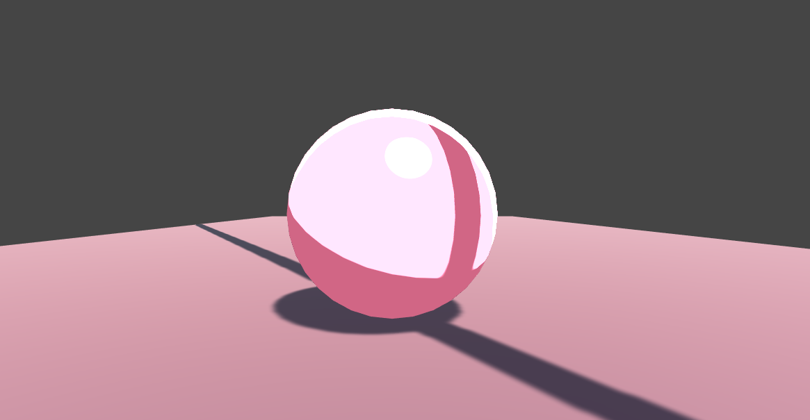
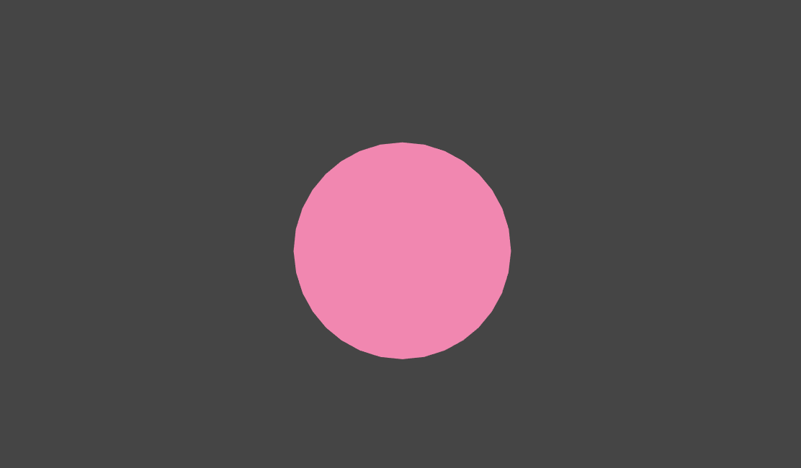
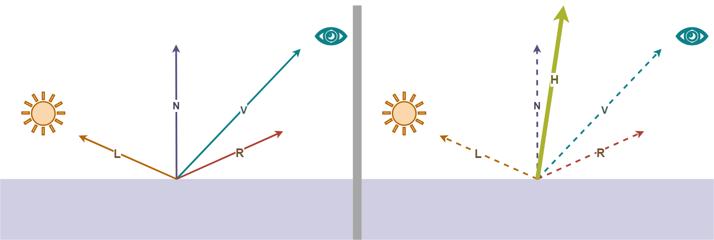
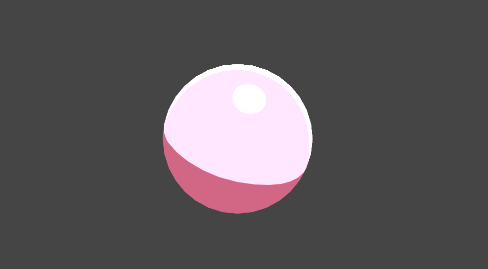

## 前言

前一篇介绍了非真实渲染的理论知识，现在来写一个卡通高光效果，效果图如下：

<!--more-->

照例我们还是先放上完整的代码

```C++
Shader "Kurong/NPR/SpecularToonShader"
{
    Properties
    {
        _Color ("Color", Color) = (1,1,1,1)
        _MainTex ("Albedo (RGB)", 2D) = "white" {}
        [HDR]_AmbientColor("Ambient Color", Color) = (1,1,1,1)
        [HDR]_SpecularColor("Specular Color", Color) = (1,1,1,1)
        _Glossiness("Glossiness", Float) = 32
        [HDR]_RimColor("Rim Color", Color) = (1,1,1,1)
        _RimAmount("Rim Amount", Range(0, 1)) = 0.5
        _RimThreshold("Rim Threshold", Range(0, 1)) = 0.1
    }
    SubShader
    {
        Pass
        {
            Tags { "LightMode" = "ForwardBase" "PassFlags" = "OnlyDirectional" }
            LOD 200
            CGPROGRAM
            #pragma vertex vert
            #pragma fragment frag
            #pragma multi_compile_fwdbase
            #include "AutoLight.cginc"
            #include "UnityCG.cginc"
            #include "Lighting.cginc"

            sampler2D _MainTex;
            float4 _Color;
            float4 _MainTex_ST;
            float4 _AmbientColor;
            float4 _SpecularColor;
            float _Glossiness;
            float4 _RimColor;
            float _RimAmount;
            float _RimThreshold;

            struct a2f
            {
                float4 vertex : POSITION;
                float3 normal : NORMAL;
            };

            struct v2f
            {
                float4 pos : SV_POSITION;
                float3 worldNormal : NORMAL;
                float3 viewDir : TEXCOORD1;
                SHADOW_COORDS(2)
            };

            v2f vert (a2f v)
            {
                v2f o;
                o.pos = UnityObjectToClipPos(v.vertex);
                o.worldNormal = UnityObjectToWorldNormal(v.normal);
                o.viewDir = WorldSpaceViewDir(v.vertex);
                TRANSFER_SHADOW(o)
                return o;
            }

            float4 frag (v2f v) : SV_Target
            {
                float3 normal = normalize(v.worldNormal);
                float NdotL = dot(_WorldSpaceLightPos0 , normal);
                float shadow = SHADOW_ATTENUATION(v);
                float lightIntensity = smoothstep(0, 0.01, NdotL * shadow);
                float4 light = lightIntensity * _LightColor0;
                float3 viewDir = normalize(v.viewDir);
                float3 halfVector = normalize(_WorldSpaceLightPos0 + viewDir);
                float NdotH = dot(normal, halfVector);
                float specularIntensity = pow(NdotH * lightIntensity, _Glossiness * _Glossiness);
                float specularIntensitySmooth = smoothstep(0.005, 0.01, specularIntensity);
                float4 specular = specularIntensitySmooth * _SpecularColor;
                float4 rimDot = 1 - dot(viewDir, normal);
                float rimIntensity = rimDot * pow(NdotL, _RimThreshold);;
                rimIntensity = smoothstep(_RimAmount - 0.01, _RimAmount + 0.01, rimIntensity);
                float4 rim = rimIntensity * _RimColor;
                return _Color * (light + _AmbientColor + specular + rim);
            }
            ENDCG
        }
    }
    FallBack "Diffuse"
}
```

## 前期准备

首先我们准备一个非常简单的Shader，去掉默认的光照，直接输出一个单一的颜色


```C++
Shader "Kurong/NPR/MainColor"
{
    Properties
    {
        _Color ("Color", Color) = (1,1,1,1)
        _MainTex ("Albedo (RGB)", 2D) = "white" {}
    }
    SubShader
    {
        Pass
        {
            Tags { "LightMode"="ForwardBase" }
            LOD 200
            CGPROGRAM
            #pragma vertex vert
            #pragma fragment frag
            #include "UnityCG.cginc"
            #include "Lighting.cginc"

            sampler2D _MainTex;
            float4 _Color;
            float4 _MainTex_ST;

            struct a2f
            {
                float4 vertex : POSITION;
            };

            struct v2f
            {
                float4 pos : SV_POSITION;
            };

            v2f vert (a2f v)
            {
                v2f o;
                o.pos = UnityObjectToClipPos(v.vertex);
                return o;
            }

            float4 frag (v2f v) : SV_Target
            {
                return _Color;
            }
            ENDCG
        }
    }
    FallBack "Diffuse"
}
```

## 单一光源

我们之前常用的表面着色器里面包含了光照效果，例如我们在查看第一个Shader的时候看见：

```C++
#pragma surface surf Standard fullforwardshadows
```

但有的时候我们希望这个材质只受单一的光源影响（在卡通渲染中经常用到），因此在Shader代码中我们进行设置：

```C++
Tags { "LightMode" = "ForwardBase" "PassFlags" = "OnlyDirectional" }
```

更多的tag可以查看[传送门](https://docs.unity3d.com/Manual/SL-PassTags.html)，这里我们采用的光照模型是 **Blinn-Phong**

### Blinn-Phong 光照模型



可以看到共有的条件有：

- 光源方向 L
- 法线方向 N
- 视线方向 V
- 反射方向 R

而 Blinn-Phong 模型引入一个新的矢量 H ，通过视角方向和光源方向相加得到，然后使用 $\vec N$ 和 $\vec H$ 的夹角进行计算：

$$ H = \frac{\vec V + \vec L}{|\vec V+\vec L|}$$

总结一下Blinn模型的公式是：

$$ C_{specular} = (C_{light} · M_{specular})max(0,\vec N · \vec H)$$

这里我们加入法线信息：

```C++
            struct a2f
            {
                float4 vertex : POSITION;
                float3 normal : NORMAL;
            };

            struct v2f
            {
                float4 pos : SV_POSITION;
                float3 worldNormal : NORMAL;
            };

            v2f vert (a2f v)
            {
                v2f o;
                o.pos = UnityObjectToClipPos(v.vertex);
                o.worldNormal = UnityObjectToWorldNormal(v.normal);
                return o;
            }

            float4 frag (v2f v) : SV_Target
            {
                float3 normal = normalize(v.worldNormal);
                float NdotL = dot(_WorldSpaceLightPos0 , normal);
                return _Color * NdotL;
            }
```

注意 **_WorldSpaceLightPos0** 表示的是当前光源的位置。这样看起来是比较真实感的渲染，卡通渲染的一大特点就是明暗交界线十分明显，因此我们做一点小小的调整：

```C++
            float4 frag (v2f v) : SV_Target
            {
                float3 normal = normalize(v.worldNormal);
                float NdotL = dot(_WorldSpaceLightPos0 , normal);
                float lightIntensity = NdotL > 0 ? 1 : 0;
                return _Color * lightIntensity;
            }
```


### 添加反射光

接下来我们添加反射光的颜色，添加属性：

```C++
            [HDR]_AmbientColor("Ambient Color", Color) = (1,1,1,1)
```

```C++
            float4 frag (v2f v) : SV_Target
            {
                float3 normal = normalize(v.worldNormal);
                float NdotL = dot(_WorldSpaceLightPos0 , normal);
                float lightIntensity = NdotL > 0 ? 1 : 0;
                float4 light = lightIntensity * _LightColor0;
                return _Color * (light + _AmbientColor);
            }
```

添加 light 用来收集和光照有关的数据，**_LightColor0** 表示单一光源的颜色。这里我们注意到明暗交界的地方锯齿比较严重，修改一下代码

```C++
                float lightIntensity = smoothstep(0, 0.01, dotL);
```


## 添加高光

卡通风格的高光往往是模型上一块明显的光斑，根据上面提到 Blinn-Phong 公式我们添加代码：

```C++
            [HDR]_SpecularColor("Specular Color", Color) = (1,1,1,1)
            _Glossiness("Glossiness", Float) = 32
```

```C++
            struct v2f
            {
                float4 pos : SV_POSITION;
                float3 worldNormal : NORMAL;
                float3 viewDir : TEXCOORD1;
            };
```

```C++
            v2f vert (a2f v)
            {
                v2f o;
                o.pos = UnityObjectToClipPos(v.vertex);
                o.worldNormal = UnityObjectToWorldNormal(v.normal);
                o.viewDir = WorldSpaceViewDir(v.vertex);
                return o;
            }

            float4 frag (v2f v) : SV_Target
            {
                float3 normal = normalize(v.worldNormal);
                float NdotL = dot(_WorldSpaceLightPos0 , normal);
                float lightIntensity = smoothstep(0, 0.01, NdotL);
                float4 light = lightIntensity * _LightColor0;
                float3 viewDir = normalize(v.viewDir);
                float3 halfVector = normalize(_WorldSpaceLightPos0 + viewDir);
                float NdotH = dot(normal, halfVector);
                float specularIntensity = pow(NdotH * lightIntensity, _Glossiness * _Glossiness) * _SpecularColor;
                return _Color * (light + _AmbientColor + specularIntensity);
            }
```

和明暗边界线的解决方案一样，也做一些小小的更改：

```C++
                float specularIntensitySmooth = smoothstep(0.005, 0.01, specularIntensity);
                float4 specular = specularIntensitySmooth * _SpecularColor;
                return _Color * (light + _AmbientColor + specular);
```


## 添加描边

我们在发光的地方添加描边，模型更加卡通化：

```C++
                [HDR]_RimColor("Rim Color", Color) = (1,1,1,1)
                _RimAmount("Rim Amount", Range(0, 1)) = 0.5
                _RimThreshold("Rim Threshold", Range(0, 1)) = 0.1
```

```C++
                float4 rimDot = 1 - dot(viewDir, normal);
                float rimIntensity = rimDot * pow(NdotL, _RimThreshold);;
                rimIntensity = smoothstep(_RimAmount - 0.01, _RimAmount + 0.01, rimIntensity);
                float4 rim = rimIntensity * _RimColor;
                return _Color * (light + _AmbientColor + specular + rim);
```



## 添加阴影

最后一步添加阴影（场景中添加一个地板和遮蔽的物体）：

```C++
                #pragma multi_compile_fwdbase
                #include "AutoLight.cginc"

                struct v2f
                {
                    float4 pos : SV_POSITION;
                    float3 worldNormal : NORMAL;
                    float3 viewDir : TEXCOORD1;
                    SHADOW_COORDS(2)
                };

                float shadow = SHADOW_ATTENUATION(v);
                float lightIntensity = smoothstep(0, 0.01, NdotL * shadow);
```


